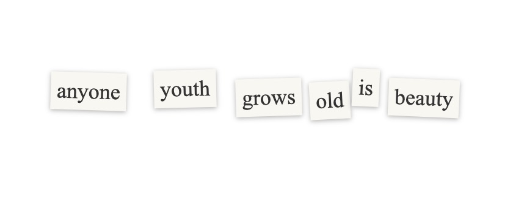

### what is this?
I used to love cutting words from newspapers to make little poems.

here is a digital version.

paste in an excerpt from your favorite book, or a news article, or a recipe, or...

or use an excerpt from one of my favorite books.

enjoy and [show me your poems](https://x.com/kbarley66) :) 

### friends made some poems :*

<i>By [Steve Li](https://x.com/steveshenli)</i>

<i>By Chris Liang</i>

<i>By [Amelia Cossentino](https://www.instagram.com/ameliacomix/)</i>

### todos
- edit layout for mobile
- handle url pasting / scraping
- support non-alphabet-based languages
- add dark mode
